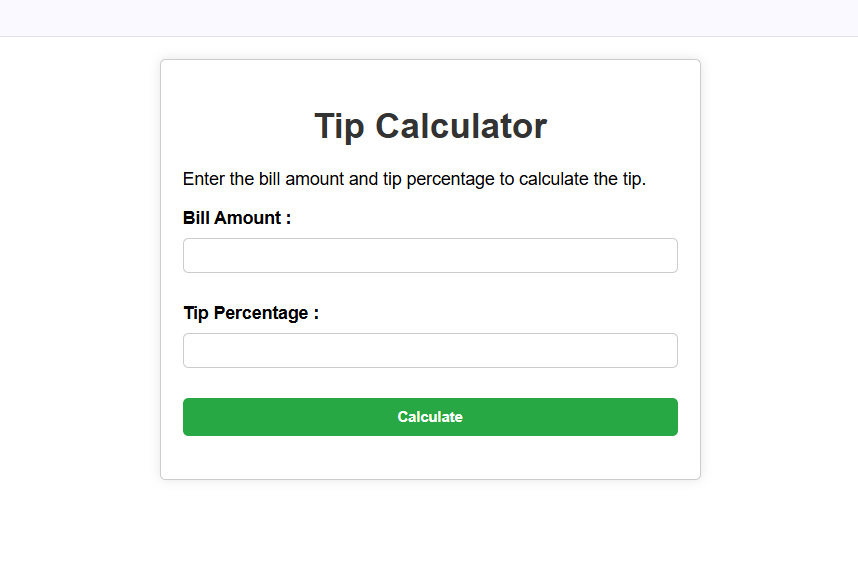

# Tip Calculator

This is a simple and responsive Tip Calculator web application built using HTML, CSS, and JavaScript.

## Features
- User can enter bill amount  
- User can enter tip percentage  
- Automatically calculates tip amount  
- Displays total bill amount  
- Responsive design  

## Technologies Used
- HTML  
- CSS  
- JavaScript  

## Screenshots

## Live Demo
You can view the live demo of the project here:  
👉 https://neelima-vallapuneni.github.io/Tip-Calculator/

## How to Run
1. Download the project files.  
2. Open `index.html` in your browser.  

## Future Enhancements
- Add multiple tip percentage buttons  
- Add dark mode feature  
- Add bill split option for multiple people  
- Improve UI with animations  

## Author
Neelima Vallapuneni
